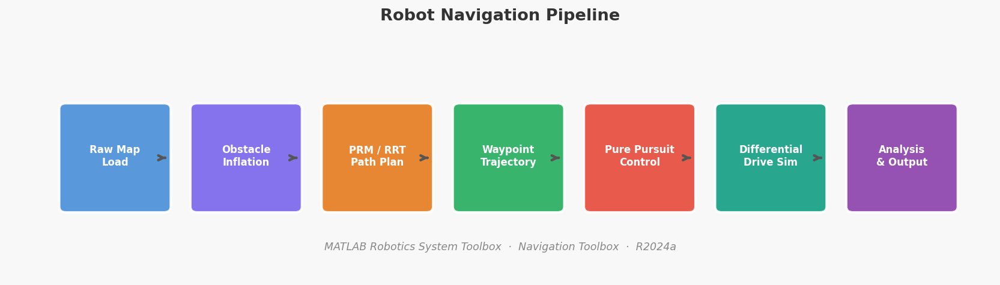
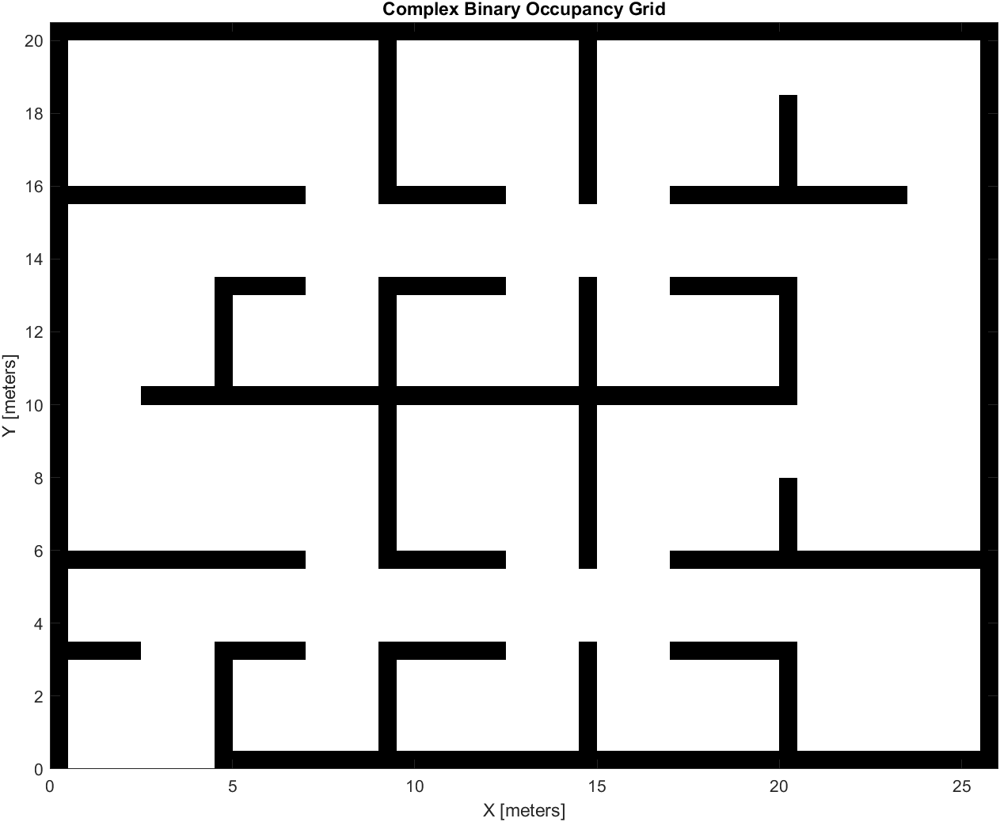
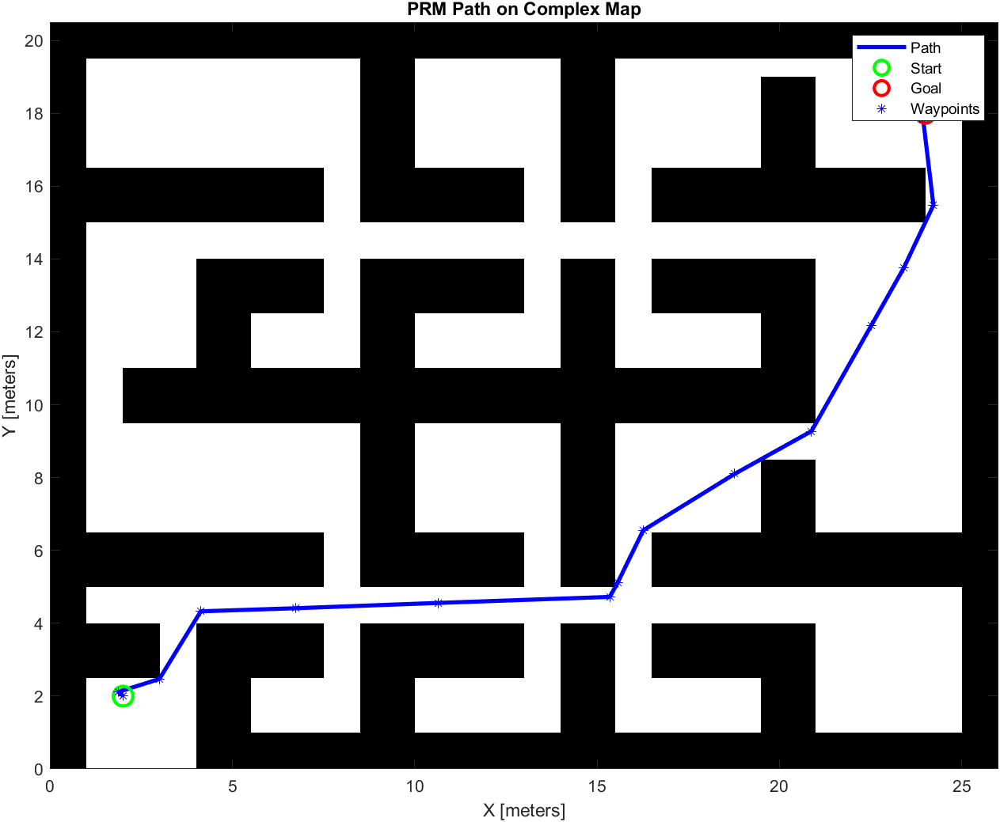
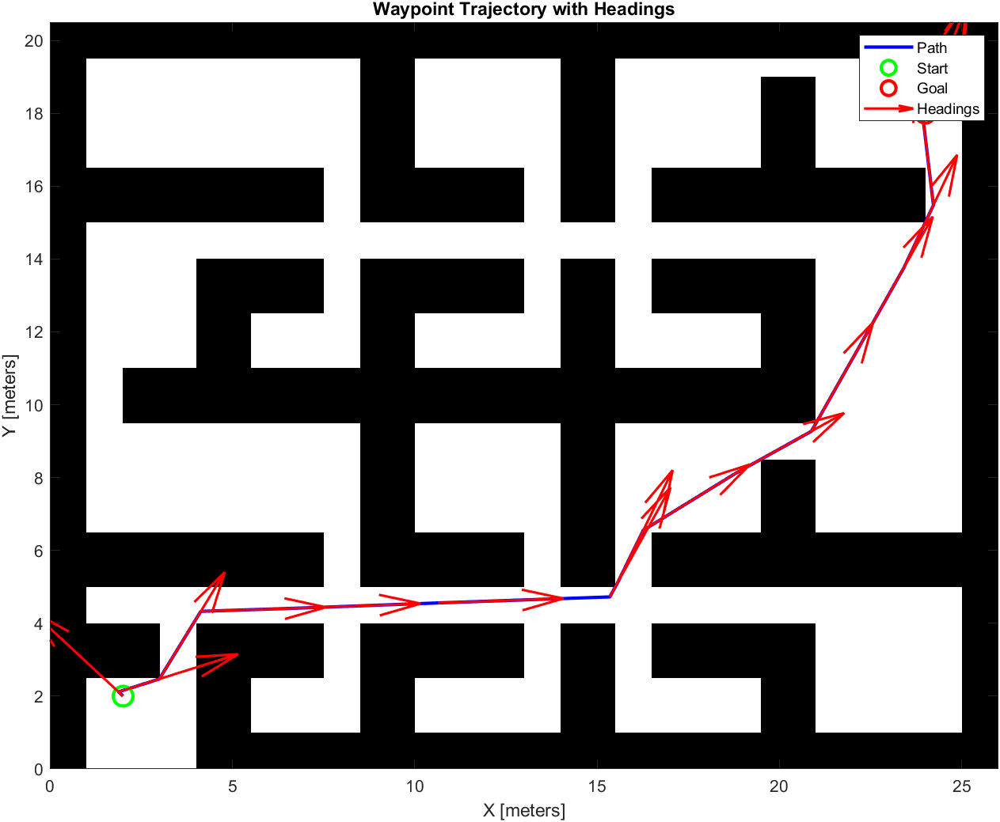
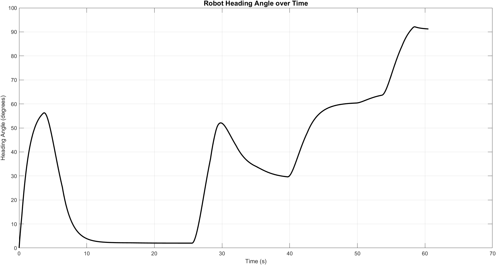
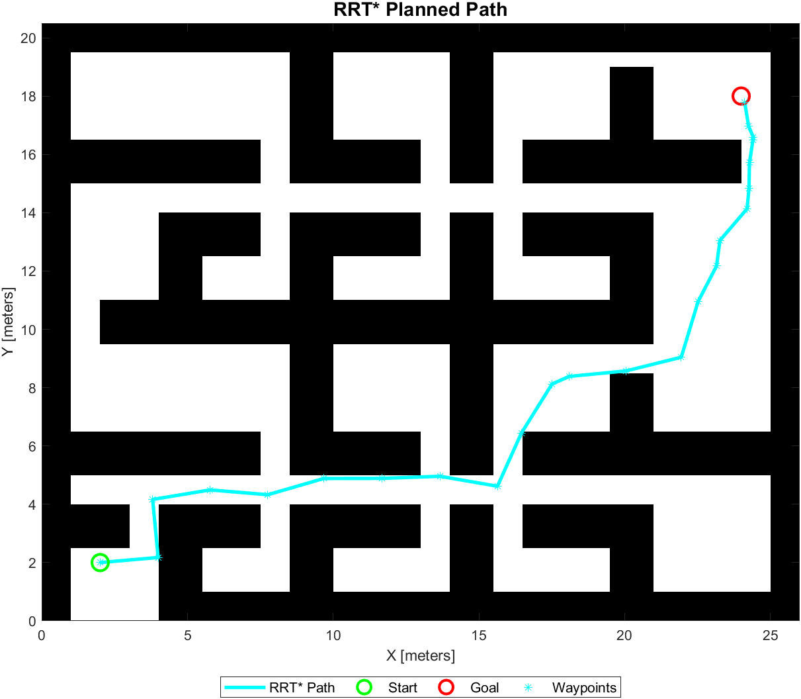

# Complex Map Robot Navigation Simulation

A complete autonomous robot navigation pipeline implemented in MATLAB, featuring binary occupancy grid mapping, probabilistic path planning (PRM, RRT, RRT*), Pure Pursuit trajectory tracking, and real-time differential drive robot simulation with video output.

---

## System Pipeline



---

## Project Overview

This project simulates a mobile robot navigating through a complex maze-like environment with obstacles. It covers the full autonomy stack — from raw map ingestion to real-time simulation and quantitative performance analysis.

```
Raw Map → Obstacle Inflation → Path Planning → Trajectory Generation → Robot Simulation → Analysis
```

| Stage              | Method                | MATLAB Tool             |
|--------------------|----------------------|-------------------------|
| Map Creation       | Binary Occupancy Grid | `binaryOccupancyMap`    |
| Obstacle Inflation | Minkowski Sum         | `inflate()`             |
| Path Planning      | PRM                   | `mobileRobotPRM`        |
| Path Planning      | RRT                   | `plannerRRT`            |
| Path Planning      | RRT*                  | `plannerRRTStar`        |
| Motion Control     | Pure Pursuit          | `controllerPurePursuit` |
| Robot Model        | Differential Drive    | Euler integration       |
| Output             | Video + Plots         | `VideoWriter`           |

---

## Repository Structure

```
complex-map-robot-simulation/
│
├── ComplexMapSimulation.mlx        ← MATLAB Live Script (recommended)
├── ComplexMapSimulation.m          ← Plain MATLAB script
│
├── results/
│   ├── assets/
│   │   └── pipeline_diagram.png
│   └── plots/
│       ├── 01_occupancy_grid.png
│       ├── 02_inflated_map.png
│       ├── 03_prm_path.png
│       ├── 04_waypoint_headings.png
│       ├── 05_simulation_final.png
│       ├── 06_position_profile.png
│       ├── 07_heading_profile.png
│       ├── 08_distance_to_goal.png
│       └── 09_rrtstar_path.png
│
├── ALGORITHM_NOTES.md              ← Explanation of PRM, RRT, RRT*
├── RESULTS_ANALYSIS.md             ← Quantitative analysis writeup
├── CHANGELOG.md
├── .gitignore
└── README.md
```

---

## Requirements

| Requirement             | Version                              |
|-------------------------|--------------------------------------|
| MATLAB                  | R2020b or later (R2024a recommended) |
| Robotics System Toolbox | Required                             |
| Navigation Toolbox      | Required                             |

---

## How to Run

1. Clone or download this repository
2. Open MATLAB and navigate to the repository folder
3. Open `ComplexMapSimulation.mlx` (recommended) or `ComplexMapSimulation.m`
4. Click **Run** or press `F5`
5. The simulation will display all intermediate plots, run the robot in real time, and save `robot_simulation.avi` to your current directory

> Open `ComplexMapSimulation.mlx` for the best experience — outputs render inline alongside the code.

---

## Demo Video

Running the simulation generates `robot_simulation.avi` — a real-time recording of the robot navigating from start `[2, 2]` to goal `[24, 18]` through the complex map.

```
Final robot pose: x=24.01, y=17.51, theta=1.59
Result: Robot reached the goal successfully
```

> To view the video, run the script locally and open the generated `.avi` file in MATLAB or any media player.

---

## How It Works

### Step 1 — Occupancy Grid Map

Loads MATLAB's built-in `complexMap` and converts it to a `binaryOccupancyMap` at 2 cells/meter resolution.



---

### Step 2 — Map Inflation

Inflates obstacles by the robot radius (0.5 m) so that path planning treats the robot as a point, guaranteeing collision-free clearance via Minkowski sum expansion.


---

### Step 3 — PRM Path Planning

Uses a Probabilistic Roadmap (PRM) with 2000 nodes and a connection distance of 5 m. If no path is found, retries with 5000 nodes and distance 8 m.

- **Start:** `[2, 2]` meters
- **Goal:** `[24, 18]` meters



---

### Step 4 — Waypoint Trajectory

Converts the PRM path into a full pose trajectory `[x, y, θ]` by computing heading angles between consecutive waypoints. Travel time is estimated at 0.5 m/s.



---

### Step 5 — Robot Simulation and Video

Runs a Pure Pursuit controller on a differential drive robot model:

```
x(t+dt)  = x(t)  + v · cos(θ) · dt
y(t+dt)  = y(t)  + v · sin(θ) · dt
θ(t+dt)  = θ(t)  + ω · dt
```

Every frame is captured and written to `robot_simulation.avi`.


*Planned trajectory (blue dashed) vs actual robot path (magenta) overlay on the inflated map.*

---

### Step 6 — Trajectory Analysis

Generates position, heading, and distance-to-goal profiles. A full metrics report is printed at the end of each run.

**X / Y Position Profile**


**Heading Angle Profile**



**Distance to Goal Convergence**


---

### Bonus — RRT and RRT* Comparison

Runs both RRT and RRT* planners on the same map for side-by-side comparison against PRM.



RRT* result: **33.91 meters**, **24 waypoints**.

---

## Results

```
============ FINAL ANALYSIS ============
Planned path length:    31.75 meters
Actual travel length:   30.25 meters
Total time simulated:   60.60 seconds
Average speed:          0.50 m/s
Path efficiency:        105.0%
Goal position:          [24.0, 18.0]
Final robot position:   [24.01, 17.51]
Position error:         0.49 meters
========================================
```

The robot successfully reached the goal with a terminal position error of **0.49 m**, well within the 0.5 m acceptance radius.

| Planner | Path Length | Waypoints |
|---------|------------|-----------|
| PRM     | 31.75 m    | —         |
| RRT*    | 33.91 m    | 24        |

---

## Tunable Parameters

| Parameter                    | Location | Default     | Effect                    |
|------------------------------|----------|-------------|---------------------------|
| `robotRadius`                | Step 2   | `0.5` m     | Inflation clearance        |
| `planner.NumNodes`           | Step 3   | `2000`      | PRM coverage               |
| `planner.ConnectionDistance` | Step 3   | `5` m       | PRM edge length            |
| `DesiredLinearVelocity`      | Step 5   | `0.5` m/s   | Robot speed                |
| `MaxAngularVelocity`         | Step 5   | `1.0` rad/s | Turn rate limit            |
| `LookaheadDistance`          | Step 5   | `1.5` m     | Pure Pursuit look-ahead    |
| `sampleTime`                 | Step 5   | `0.1` s     | Simulation timestep        |
| `goalRadius`                 | Step 5   | `0.5` m     | Goal acceptance radius     |

---

## Concepts Covered

- Binary occupancy grid mapping
- Configuration space obstacle inflation (Minkowski sum)
- Sampling-based motion planning: PRM, RRT, RRT*
- Pure Pursuit path tracking
- Differential drive kinematics (Euler integration)
- Trajectory analysis and quantitative metrics
- Real-time visualization and video recording in MATLAB

---

## Author

**Ishaan Jha**  
B.Tech Mechatronics Engineering — IIIT Bhagalpur  
Skills: MATLAB · Robotics · Path Planning · Autonomous Navigation

---

## License

MIT License — see [LICENSE](LICENSE) for details.
