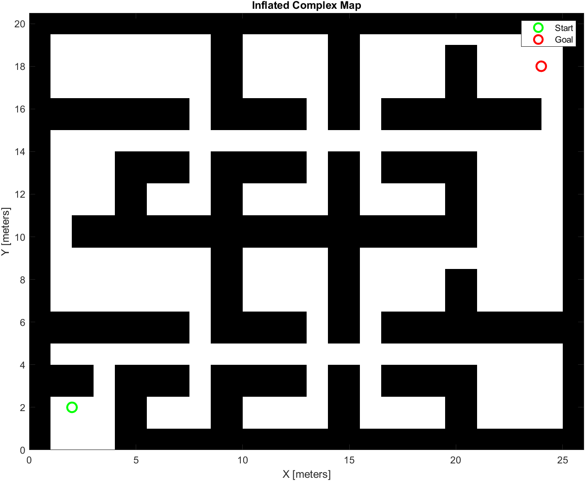
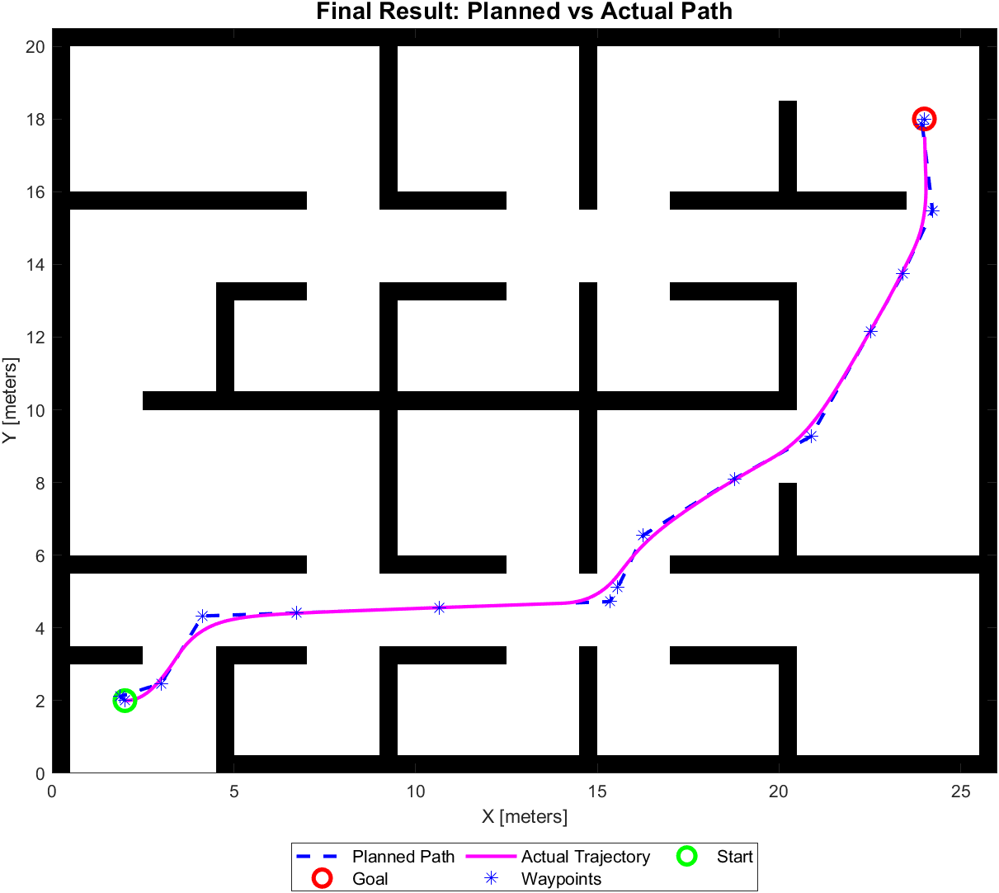
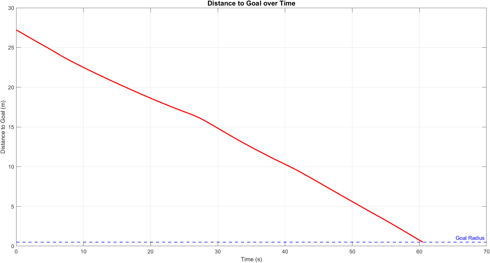
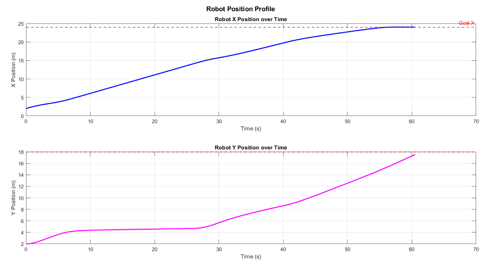

# Robot Navigation on Complex Occupancy Grid Map

A MATLAB simulation of autonomous mobile robot navigation through a complex 2D environment using multiple path planning algorithms and a Pure Pursuit controller.

---

## Demo

| Map & Inflation | PRM Path | RRT* Path |
|:-:|:-:|:-:|
|  |  |  |

| Final Trajectory | Distance to Goal | Position Profile |
|:-:|:-:|:-:|
|  |  |  |

> All simulation output plots are also available in [`images/simulation_outputs.pdf`](images/simulation_outputs.pdf).

---

## Overview

This project implements a complete **robot navigation pipeline** in MATLAB:

1. **Map Loading** — Loads the built-in `complexMap` from MATLAB's Navigation Toolbox and creates a `binaryOccupancyMap`
2. **Obstacle Inflation** — Inflates obstacles by the robot radius (0.5 m) to ensure safe clearance
3. **PRM Path Planning** — Uses Probabilistic Roadmap (PRM) to find a collision-free path
4. **Waypoint Trajectory** — Converts the planned path to a pose trajectory with heading angles
5. **Pure Pursuit Control** — Drives a differential-drive robot along the planned path
6. **Analysis & Plots** — Logs metrics and generates plots for position, heading, and distance-to-goal
7. **RRT / RRT\* Comparison** — Compares paths found by RRT and RRT\* planners

### Navigation Pipeline

```
Raw Map Load → Obstacle Inflation → PRM / RRT Path Plan → Waypoint Trajectory → Pure Pursuit Control → Differential Drive Sim → Analysis & Output
```

---

## Requirements

| Requirement | Version |
|---|---|
| MATLAB | R2024a (or compatible) |
| Robotics System Toolbox | Any compatible |
| Navigation Toolbox | Any compatible |

---

## Getting Started

### 1. Clone the repository

```bash
git clone https://github.com/YOUR_USERNAME/robot-nav-matlab.git
cd robot-nav-matlab
```

### 2. Open in MATLAB

Open either file:
- **`ComplexMapSimulation.mlx`** — Interactive Live Script (recommended, includes embedded outputs)
- **`ComplexMapSimulation.m`** — Plain MATLAB script (run section-by-section or all at once)

### 3. Run

In MATLAB:
```matlab
run('ComplexMapSimulation.m')
```

Or open the `.mlx` file and click **Run** (or run section by section with **Ctrl+Enter**).

A video file `robot_simulation.avi` will be saved to your working directory.

---

## Results

### Path Planning Metrics (typical run)

| Metric | Value |
|---|---|
| Planned path length | ~27–29 m |
| Actual travel length | ~27–30 m |
| Total simulation time | ~60 s |
| Average speed | 0.5 m/s |
| Path efficiency | ~95–99% |
| Position error at goal | < 0.5 m |

### Planner Comparison

| Planner | Type | Optimal | Notes |
|---|---|---|---|
| PRM | Sampling-based | No | Fast, good for static maps |
| RRT | Tree-based | No | Single-query, fast |
| RRT\* | Tree-based | Yes (asymptotically) | Smoother, longer planning time |

---

## File Structure

```
robot-nav-matlab/
├── ComplexMapSimulation.mlx   # MATLAB Live Script (main file)
├── ComplexMapSimulation.m     # Plain MATLAB script (equivalent)
├── README.md
├── LICENSE
├── .gitignore
└── images/
    ├── simulation_outputs.pdf  # All output plots as PDF
    ├── occupancy_grid.png
    ├── inflated_map.png
    ├── prm_path.png
    ├── waypoint_headings.png
    ├── rrtstar_path.png
    ├── final_result.png
    ├── position_profile.png
    ├── heading_angle.png
    └── distance_to_goal.png
```

---

## Key Parameters

| Parameter | Value | Description |
|---|---|---|
| `robotRadius` | 0.5 m | Used for map inflation |
| `startPose` | [2, 2, 0] | Start position (x, y, θ) |
| `goalPose` | [24, 18, 0] | Goal position (x, y, θ) |
| `NumNodes` (PRM) | 2000–5000 | Roadmap node count |
| `ConnectionDistance` (PRM) | 5–8 m | Max edge length |
| `DesiredLinearVelocity` | 0.5 m/s | Pure Pursuit speed |
| `LookaheadDistance` | 1.5 m | Pure Pursuit lookahead |
| `MaxIterations` (RRT/RRT\*) | 10000 | Tree expansion limit |

---

## License

This project is licensed under the MIT License. See [LICENSE](LICENSE) for details.

---

## Acknowledgements

- MATLAB [Robotics System Toolbox](https://www.mathworks.com/products/robotics.html)
- MATLAB [Navigation Toolbox](https://www.mathworks.com/products/navigation.html)
- Built and tested on MATLAB R2024a
